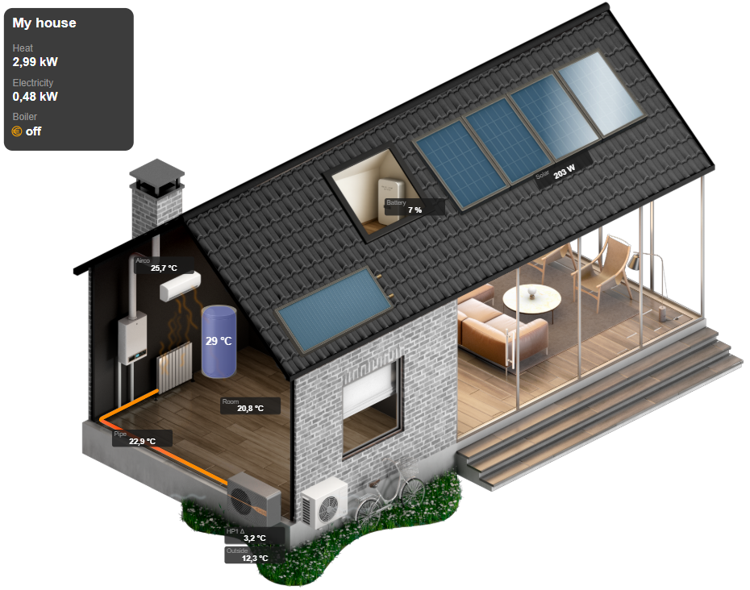
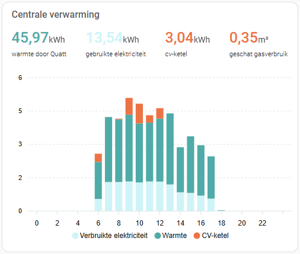

# Quatt integration for Home Assistant

[![GitHub Release][releases-shield]][releases]
[![GitHub Activity][commits-shield]][commits]
[![License][license-shield]](LICENSE)

[![hacs][hacsbadge]][hacs]
![Project Maintenance][maintenance-shield]
[![BuyMeCoffee][buymecoffeebadge]][buymecoffee]

_Unofficial integration for Quatt Heat Pump._

## Installation

### Install with HACS (recommended)

Do you have [HACS](https://hacs.xyz/) installed?

1. [Click here](https://my.home-assistant.io/redirect/hacs_repository/?owner=marcoboers&repository=home-assistant-quatt&category=integration) or add repository manually
   - Select Integrations, then select the 3-dots in the upper-right corner, then select Custom Repositories.
   - Put the Reposity URL in the Repository field, then select Integration in the Category dropdown list and click Add.
1. Search integrations for **Quatt**
1. Click `Install`
1. Restart Home Assistant

### Install manually

1. Using the tool of choice open the directory (folder) for your HA configuration (where you find `configuration.yaml`).
1. If you do not have a `custom_components` directory (folder) there, you need to create it.
1. In the `custom_components` directory (folder) create a new folder called `quatt`.
1. Download in the `Releases` section the `quatt.zip` file for the version of the integration you want to install and extract the files. Alternatively, download _all_ the files from the `custom_components/quatt/` directory (folder) in this repository. Note that the version number will not be updated if you choose the latter.
1. Place the files you downloaded in the new directory (folder) you created.
1. Restart Home Assistant

## Configuration

### Manual

1. In Home Assistant click on `Settings`
1. Click on `Devices & services`
1. Click on `Integrations`
1. Click on `+ Add integration`
1. Search for and select `Quatt`
1. Enter the ip address of your Quatt CIC (for instance: 192.168.0.100 without http:// or port number)
1. Click `Submit`
1. Enjoy

### Auto-discovery

The Quatt integration relies on DHCP requests made by the Commander In Chief (CIC) for autodiscovery. To force a DHCP request, turn off the CIC and wait 10 seconds and turn it back on again.

1. In Home Assistant click on `Settings`
1. Click on `Devices & services`
1. In case the `Quatt` has been auto-discovered, the discovered CIC is shown at the top of the screen
1. Click on `Configure`
1. Click on `Submit` to confirm to automatically add the integration to Home Assistant
1. Enjoy

## Remote Mobile API (Optional)

This integration supports the **Quatt Remote Mobile API** as an optional addition to the local CIC JSON API. The remote API provides access to additional sensors and controls beyond what's available through the local API.

**Special thanks to [@WoutervanderLoopNL](https://github.com/WoutervanderLoopNL) for reverse engineering the official Quatt mobile app, which made this remote API support possible!**

### Key Features

- **Additional sensors**: Access to sensors not available via the local API (see list below)
- **Sound level controls**: Programmable day and night maximum sound levels (normal, library, silent)
- **Smart filtering**: Only sensors not already available through the local API are added, avoiding duplicates
- **Seamless integration**: Remote API is configured as an optional toggle on the existing CIC device

### Additional Sensors Available via Remote API

The remote API provides access to numerous sensors that complement the local API:

- **Connectivity status**: WiFi SSID, WiFi/LTE/cable connection status
- **Energy pricing**: Electricity prices (standard, day, night), gas prices, and night time schedule configuration
- **Sound control**: Silent mode status, day/night max sound levels, and sound schedule configuration
- **Heat battery metrics** (All-Electric only): Serial number, status, size, charge percentage
- **Enhanced heat pump data**: Compressor frequency (actual and demand), minimum/rated/expected power, water pump level, ODU type, on/off status, Modbus slave ID
- **Installation details**: Installation date, insights start date, Quatt build version, installation name, location (zip code, country), and order number
- **Thermostat data**: Outside temperature (via remote API)
- **Boiler data** (Hybrid only): Additional boiler power and temperature sensors

### Important Considerations

- **Beta status**: This feature is currently in **beta** with no backwards compatibility guarantees between versions
- **Optional feature**: The integration works fully with only the local API; remote API is optional
- **Reverse engineered API**: The remote API was obtained through reverse engineering of the official Quatt mobile app. As such, the long-term stability cannot be guaranteed
- **Dependent on Quatt**: This feature depends on Quatt's remote API infrastructure. Changes to Quatt's authentication system or API may cause the remote API integration to stop working
- **No official support**: Since this is based on reverse engineering, there is no official support from Quatt for this functionality
- **Smart filtering**: The integration intelligently filters remote sensors to avoid duplicating data already available from the local API

### Enabling Remote API

To enable the remote API for your existing Quatt CIC:

#### During Initial Setup

1. In Home Assistant, go to `Settings` → `Devices & services` → `Integrations`
2. Click `+ Add integration` and search for **Quatt**
3. Enter your **CIC IP address** (e.g., 192.168.0.100)
4. When prompted, **enable Remote API** by toggling the option
5. Enter your **first name** and **last name**
6. **Within 60 seconds**, press the physical button on your CIC to complete pairing
7. The setup will complete with both local and remote API active

#### Adding to Existing Integration

1. Go to `Settings` → `Devices & services` → `Integrations`
2. Find your Quatt integration and click **Configure**
3. Enable the **Add Remote API** toggle
4. Enter your **first name** and **last name**
5. **Within 60 seconds**, press the physical button on your CIC to complete pairing
6. The integration will reload with remote API sensors and controls available

Once enabled, additional sensors and the sound level controls will appear in your Home Assistant installation.

## Quatt Dashboard Card (Optional)

This integration includes a fully-featured **Quatt Dashboard Card** that replicates and enhances the dashboard from the official Quatt mobile app directly in your Home Assistant interface. This provides a comprehensive, at-a-glance view of your Quatt heat pump system status and performance.

**Special thanks to [@WoutervanderLoopNL](https://github.com/WoutervanderLoopNL) for reverse engineering the official Quatt mobile app. The extracted images form the foundation of this card!**



### Features

- **Complete system overview**: Visual representation of your entire Quatt system including heat pump(s), boiler, and heat battery
- **Real-time status**: Live updates of temperatures, power consumption, and operating modes
- **Universal support**: Works with all Quatt configurations:
  - Hybrid setups (heat pump + boiler)
  - All-Electric setups (with heat battery/heat charger)
  - Quatt Mono (single heat pump)
  - Quatt Duo (dual heat pumps)
- **Additional features**:
  - Airconditioning integration including heating and cooling animations
  - Solar panel integration including animations
  - Solar collector integration including animations
  - Home battery integration
  - Hot water tank integration including water temperature animations
- **Responsive design**: Adapts to different screen sizes and devices
- **Custom card implementation**: Uses a dedicated Lovelace custom card for optimal performance

### Prerequisites

The Quatt Dashboard works with the **local CIC JSON API**. Configuring the **Remote Mobile API** is optional but recommended for more accurate heat pump images.

To get the most out of the Quatt Dashboard:

1. **Optional: Remote API configured**: Configure the Remote Mobile API (see [Remote Mobile API](#remote-mobile-api-optional) section above).
2. **Optional: `OduType` sensor enabled**: The `OduType` (ODU Type) sensor is used to select the correct heat pump image.

   - When `OduType` is **available and enabled**, the dashboard shows the **accurate heat pump image** for your unit.
   - When `OduType` is **not available** (for example if the Remote API is not configured), the dashboard will still work but will fall back to **generic v1 heat pump images**.

   The `OduType` sensor is disabled by default. To enable it:

   - Go to `Settings` → `Devices & services` → `Integrations` → `Quatt`
   - Click on your CIC device
   - Find the `OduType` sensor, you will find it under the Diagnostics of the Heatpump (if you have two heatpumps enabling one is enough)
   - Click on the sensor and enable it

### Installation

The Quatt Dashboard is implemented as a custom Lovelace card which is installed automatically during installation of the integration, making it easy to add the card to any dashboard.

### Troubleshooting

- **Card not found**:
  - Ensure Home Assistant has loaded the integration properly. Does the config have a `quatt-dashboard-card.js` file in `<HA config>/custom_components/quatt/www/js/`? Download a newer version when the file is missing.
  - Try restarting Home Assistant
  - Caching can be an issue, clear the cache or try incognito mode
- **Generic heat pump image**: Enable and configure the `OduType` sensor (requires Remote API) to show the accurate heat pump image instead of the generic v1 image
- **Mobile card not loading**: On Android/iOS devices newly added cards may not load. Caching can be an issue. On Android/iOS clear the cache and or wipe Home Assistant application data and log back in. On iOS a double pull down of the screen with the card in it may result in it loading properly.

## Quatt Daily Usage Graph with ApexCharts (Optional)

With the `quatt.get_insights` action it is possible to recreate a Quatt-style **daily usage graph** (similar to the official app) in Home Assistant.



This setup uses four building blocks that work together:

- The `quatt.get_insights` **action (service)** to fetch today’s detailed usage data from Quatt
- A small **Python script** that stores the retrieved JSON data in a Home Assistant sensor
- A set of **helper template sensors** that expose daily totals for use in the card header
- An **ApexCharts custom card** that reads both the raw insights sensor and the helper sensors and renders a stacked kWh bar chart

All example files are included in this repository:

- Python script: [`examples/set_quatt_insights.py`](examples/set_quatt_insights.py)
- Automation: [`examples/quatt_insights_today.yaml`](examples/automation_quatt_insights.yaml)
- Template sensors: [`examples/helpers_quatt_insights.yaml`](examples/helpers_quatt_insights.yaml)
- ApexCharts card: [`examples/quatt_daily_usage_apexcharts.yaml`](examples/apexcharts_quatt_daily_usage.yaml)

### Prerequisites

1. **ApexCharts card installed**

   Install the **ApexCharts Card** via HACS (Frontend → Search for `apexcharts-card`).

2. **Python Scripts enabled in Home Assistant**

   In your `configuration.yaml`:

   ```yaml
   python_script:
   ```

   Create a `python_scripts` folder in your Home Assistant config directory if it doesn’t exist yet.

#### Step 1 – Python script: store insights in a sensor

Copy the contents of:

- [`examples/set_quatt_insights.py`](examples/set_quatt_insights.py)

into a file called:

- `<HA config>/python_scripts/set_quatt_insights.py`

This script creates/updates `sensor.quatt_insights` with the daily insights data retrieved from the Quatt integration.

#### Step 2 – Automation: fetch today’s insights every 10 minutes

Import the automation from:

- [`examples/quatt_insights_today.yaml`](examples/automation_quatt_insights.yaml)

You can either:

- Paste the contents into Settings → Automations & Scenes → Add automation → Edit in YAML, or
- Include it in your `automations.yaml`

This automation:

- Runs on Home Assistant startup and then every 10 minutes
- Calls `quatt.get_insights` for today (timeframe: day)
- Retries up to 3 times until valid _today_ data is returned
- Calls `python_script.set_quatt_insights` to update `sensor.quatt_insights`

#### Step 3 – Template sensors: daily totals for header values

To show daily totals in the card header, create four helper template sensors:

- `sensor.quatt_heat_today`
- `sensor.quatt_electricity_today`
- `sensor.quatt_boiler_today`
- `sensor.quatt_gas_today`

How to create:

- Create them via Settings → Devices & services → Helpers → + Create helper → Template, or
- Define them in YAML (see [`examples/helpers_quatt_insights.yaml`](examples/helpers_quatt_insights.yaml))

#### Step 4 – ApexCharts card: Quatt daily usage graph

Add a new Manual card in your dashboard and paste the contents of:

- [`examples/quatt_daily_usage_apexcharts.yaml`](examples/apexcharts_quatt_daily_usage.yaml)

This card displays the daily usage graph similar to the official Quatt app.

## Sensors

All sensors from the local API feed are available. In addition, the following computed sensors are provided:

#### CIC

- **Supervisory control mode**: Textual representation of the QC `supervisoryControlMode` status.
- **COP**: Calculated using the produced heat and the power consumed by the external power sensor (configurable).
- **Heat power**: Heat output of the heat pumps.
- **Total power**: Combined heat output of both heatpumps (Quatt Duo only).
- **Total power input**: Combined power input of both heatpumps (Quatt Duo only).
- **Total system power**: Combined system power
  - All-electric setup: `heat charger + heatpump(s)`
  - Standard setup: `boiler + heatpump(s)`
- **Total Quatt COP**: COP calculated using the produced heat and the power used by the heatpump(s).

#### Heatpump

- **Quatt COP**: COP calculated using the produced heat and the power used by the heatpump.
- **Water delta**: Difference between inlet and outlet water temperatures.

#### Boiler

- **Heat power**: Heat output of the boiler.

## Contributions are welcome!

Special thanks to [@patrickvorgers](https://github.com/patrickvorgers) for maintaining this integration and enhancing the integration to its current level.

If you want to contribute to this please read the [Contribution guidelines](CONTRIBUTING.md)

[home-assistant-quatt]: https://github.com/marcoboers/home-assistant-quatt
[buymecoffee]: https://www.buymeacoffee.com/marcoboers
[buymecoffeebadge]: https://www.buymeacoffee.com/assets/img/custom_images/orange_img.png
[commits-shield]: https://img.shields.io/github/commit-activity/y/marcoboers/home-assistant-quatt.svg?style=for-the-badge
[commits]: https://github.com/marcoboers/home-assistant-quatt/commits/main
[hacs]: https://my.home-assistant.io/redirect/hacs_repository/?owner=marcoboers&repository=home-assistant-quatt&category=integration
[hacsbadge]: https://img.shields.io/badge/HACS-Custom-orange.svg?style=for-the-badge
[exampleimg]: example.png
[forum-shield]: https://img.shields.io/badge/community-forum-brightgreen.svg?style=for-the-badge
[forum]: https://community.home-assistant.io/
[license-shield]: https://img.shields.io/github/license/marcoboers/home-assistant-quatt.svg?style=for-the-badge
[maintenance-shield]: https://img.shields.io/badge/maintainer-marcoboers-blue.svg?style=for-the-badge
[releases-shield]: https://img.shields.io/github/release/marcoboers/home-assistant-quatt.svg?style=for-the-badge
[releases]: https://github.com/marcoboers/home-assistant-quatt/releases
