# Quatt integration for Home Assistant

[![GitHub Release][releases-shield]][releases]
[![GitHub Activity][commits-shield]][commits]
[![License][license-shield]](LICENSE)

[![hacs][hacsbadge]][hacs]
![Project Maintenance][maintenance-shield]
[![BuyMeCoffee][buymecoffeebadge]][buymecoffee]

_Unofficial integration for Quatt Heat Pump and Quatt Home Battery._

This integration covers the **local CIC JSON API** (heat pump telemetry) plus a number of optional features built on top of the **Quatt mobile API** (additional remote sensors, home battery support, chill support, dashboard card, ApexCharts usage graphs).

## Table of contents

- [Installation](#installation)
- [Configuration](#configuration)
- [Sensors](#sensors)
- [About reverse-engineered features](#about-reverse-engineered-features)
- [Remote Mobile API](#remote-mobile-api)
- [Home battery](#home-battery)
- [Dashboard card](#dashboard-card)
- [Usage graphs with ApexCharts](#usage-graphs-with-apexcharts)
- [Actions reference](#actions-reference)
- [Contributions](#contributions)

## Installation

### Install with HACS (recommended)

Do you have [HACS](https://hacs.xyz/) installed?

1. [Click here](https://my.home-assistant.io/redirect/hacs_repository/?owner=marcoboers&repository=home-assistant-quatt&category=integration) or add repository manually
   - Select Integrations, then select the 3-dots in the upper-right corner, then select Custom Repositories.
   - Put the Repository URL in the Repository field, then select Integration in the Category dropdown list and click Add.
2. Search integrations for **Quatt**
3. Click `Install`
4. Restart Home Assistant

### Install manually

1. Using the tool of choice open the directory (folder) for your HA configuration (where you find `configuration.yaml`).
2. If you do not have a `custom_components` directory (folder) there, you need to create it.
3. In the `custom_components` directory (folder) create a new folder called `quatt`.
4. Download in the `Releases` section the `quatt.zip` file for the version of the integration you want to install and extract the files. Alternatively, download _all_ the files from the `custom_components/quatt/` directory (folder) in this repository. Note that the version number will not be updated if you choose the latter.
5. Place the files you downloaded in the new directory (folder) you created.
6. Restart Home Assistant

## Configuration

The Quatt integration supports two device kinds: a **CIC (heat pump)** and a **home battery**. Either can be added on its own, or both alongside each other.

### Adding a CIC (heat pump)

#### Manual

1. In Home Assistant click on `Settings`
2. Click on `Devices & services`
3. Click on `Integrations`
4. Click on `+ Add integration`
5. Search for and select `Quatt`
6. Enter the IP address of your Quatt CIC (for instance: 192.168.0.100, without `http://` or port number)
7. Click `Submit`
8. Enjoy

#### Auto-discovery

The Quatt integration relies on DHCP requests made by the Commander In Chief (CIC) for autodiscovery. To force a DHCP request, turn off the CIC, wait 10 seconds and turn it back on again.

1. In Home Assistant click on `Settings`
2. Click on `Devices & services`
3. In case the `Quatt` has been auto-discovered, the discovered CIC is shown at the top of the screen
4. Click on `Configure`
5. Click on `Submit` to confirm to automatically add the integration to Home Assistant
6. Enjoy

### Adding a home battery

To pair your home battery you need three values which you can find on the home battery label or in the Quatt mobile app:

- **UUID** (access key)
- **Serial number**
- **Check code**

Steps:

1. In Home Assistant, go to `Settings` → `Devices & services` → `Integrations`
2. Click `+ Add integration` and search for **Quatt**
3. In the "What kind of Quatt device do you want to add?" menu, select **Home battery**
4. Sign in to the Quatt mobile API (see [Quatt mobile API sign-in](#quatt-mobile-api-sign-in))
5. Enter the **UUID**, **Serial number** and **Check code** from the battery label
6. Click `Submit` — Home Assistant pairs the home battery via the Quatt mobile API
7. A new **Home battery** hub device appears with sub-devices **Savings**, **Insights** and **Energy flow** for cumulative savings, today's 15-minute insights and today's energy flow respectively

### Quatt mobile API sign-in

Several features depend on the **Quatt mobile API**: the [Remote Mobile API](#remote-mobile-api) on the CIC, and the [Home battery](#home-battery). They share a single sign-in:

- The first time you add a Quatt device that needs the mobile API, you'll be asked for your **first name** and **last name** (and, for the CIC, a 60-second confirmation by pressing the physical button on the CIC).
- The credentials are stored locally in Home Assistant and reused automatically for any other Quatt device you add later — so the sign-in step is skipped on subsequent setups.

## Sensors

All sensors from the local API feed are available. In addition, the following computed sensors are provided:

#### CIC

- **Supervisory control mode**: Textual representation of the QC `supervisoryControlMode` status.
- **COP**: Calculated using the produced heat and the power consumed by the external power sensor (configurable).
- **Heat power**: Heat output of the heat pumps.
- **Total power**: Combined heat output of both heatpumps (Quatt Duo only).
- **Total power input**: Combined power input of both heatpumps (Quatt Duo only).
- **Total system power**: Combined system power
  - All-electric setup: `heat charger + heatpump(s)`
  - Standard setup: `boiler + heatpump(s)`
- **Total Quatt COP**: COP calculated using the produced heat and the power used by the heatpump(s).

#### Heatpump

- **Quatt COP**: COP calculated using the produced heat and the power used by the heatpump.
- **Water delta**: Difference between inlet and outlet water temperatures.

#### Boiler

- **Heat power**: Heat output of the boiler.

> Additional sensors are available when the [Remote Mobile API](#remote-mobile-api) is enabled.

## About reverse-engineered features

A number of features in this integration are built on top of the **Quatt mobile API**, which was reverse-engineered from the official Quatt mobile app:

- [Remote Mobile API](#remote-mobile-api)
- [Chill](#chill)
- [Home battery](#home-battery)
- [Dashboard card](#dashboard-card)
- [Usage graphs with ApexCharts](#usage-graphs-with-apexcharts)

These features are **fully supported in this integration**, but the same caveats apply to all of them:

- **Reverse-engineered**: The Quatt mobile API was obtained by reverse-engineering the official Quatt mobile app. Special thanks to [@WoutervanderLoopNL](https://github.com/WoutervanderLoopNL) for the original work that made every mobile-API feature in this integration possible.
- **Dependent on Quatt**: These features rely on Quatt's mobile-API infrastructure. If Quatt changes their authentication or API on their side, the corresponding features may stop working until this integration is updated.
- **No official Quatt support**: Since these features are based on reverse-engineering, Quatt does not offer official support for them.

The **Dashboard card** and the **Usage graphs with ApexCharts** examples are additionally still in **beta**, with no backwards-compatibility guarantees between versions.

## Remote Mobile API

The Remote Mobile API extends the local CIC integration with additional sensors and controls that are only available through the Quatt mobile API. It is **opt-in**: the integration works fully with only the local API.

It also adds support for **Quatt Chill** devices when they are present on your installation.

### Additional sensors via remote API

Only sensors that are not already provided by the local API are added — no duplicates.

- **Connectivity status**: WiFi SSID, WiFi/LTE/cable connection status
- **Energy pricing**: Electricity prices (standard, day, night), gas prices, and night time schedule configuration
- **Sound control**: Silent mode status, day/night max sound levels, and sound schedule configuration
- **Quatt Chill support**: Climate control for heating/cooling, target temperature and fan mode, plus Chill status and diagnostic sensors
- **Heat battery metrics** (All-Electric only): Serial number, status, size, charge percentage
- **Enhanced heat pump data**: Compressor frequency (actual and demand), minimum/rated/expected power, water pump level, ODU type, on/off status, Modbus slave ID
- **Installation details**: Installation date, insights start date, Quatt build version, installation name, location (zip code, country), and order number
- **Thermostat data**: Outside temperature (via remote API)
- **Boiler data** (Hybrid only): Additional boiler power and temperature sensors

In addition, the remote API exposes **programmable day and night maximum sound levels** (normal, library, silent) as controls.

### Enabling

The Remote Mobile API can be enabled either while adding the CIC for the first time, or on an existing CIC.

#### During initial setup

1. In Home Assistant, go to `Settings` → `Devices & services` → `Integrations`
2. Click `+ Add integration` and search for **Quatt**
3. Enter your **CIC IP address** (e.g. 192.168.0.100)
4. When prompted, **enable Remote API** by toggling the option
5. Sign in to the Quatt mobile API (see [Quatt mobile API sign-in](#quatt-mobile-api-sign-in))
6. **Within 60 seconds**, press the physical button on your CIC to complete pairing
7. Setup completes with both local and remote API active

#### Adding to an existing integration

1. Go to `Settings` → `Devices & services` → `Integrations`
2. Find your Quatt integration and click **Configure**
3. Enable the **Add Remote API** toggle
4. Sign in to the Quatt mobile API (see [Quatt mobile API sign-in](#quatt-mobile-api-sign-in))
5. **Within 60 seconds**, press the physical button on your CIC to complete pairing
6. The integration reloads with the remote API sensors and controls available

## Chill

- **Climate control**: A climate entity for Quatt Chill devices with heating, cooling, target temperature and fan mode control.
- **Status and diagnostics**: Chill mode, fan mode, ambient temperature, status and update-state sensors.

## Home battery

The home battery is a separate device that can be added alongside (or independently of) a Quatt heat pump. Once paired it exposes live status, savings, insights and full energy-flow data (battery, solar, house, grid) in Home Assistant.

<table>
  <tr>
    <td align="center">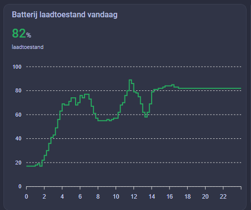<br><b>Insights (today)</b></td>
    <td align="center">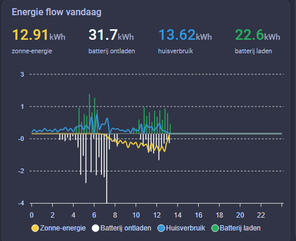<br><b>Energy flow (day)</b></td>
    <td align="center">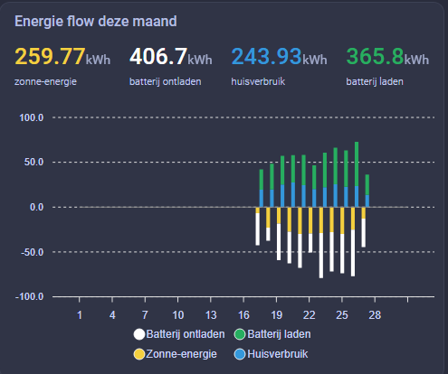<br><b>Energy flow (month)</b></td>
  </tr>
  <tr>
    <td align="center">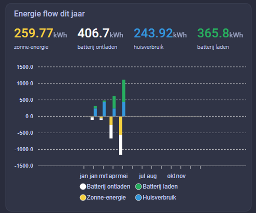<br><b>Energy flow (year)</b></td>
    <td align="center">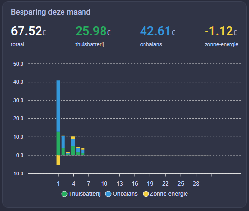<br><b>Savings (month)</b></td>
    <td align="center">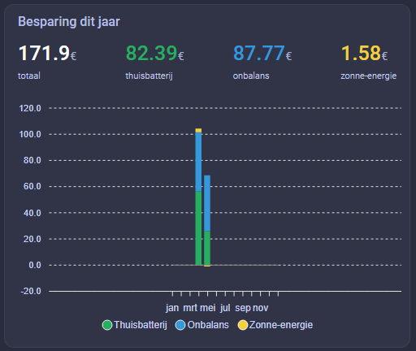<br><b>Savings (year)</b></td>
  </tr>
</table>

### Features

- **Stand-alone device**: A home battery can be added without a CIC/heat pump — pick "Home battery" in the `+ Add integration` menu
- **Live status**: State of charge, power, power flow direction, control action, control mode, capacity and inverter power
- **Cumulative and yesterday savings**: Total, home battery, solar and imbalance savings in euros (incl. and excl. VAT)
- **Today's insights**: Charged/discharged kWh, peak charge/discharge power, highest/lowest SoC (based on the 15-minute timeseries)
- **Today's energy flow**: Battery charged/discharged, solar production, house consumption, grid import/export in kWh
- **Solar capacity control**: A `Solar capacity` number entity that PATCHes `solarCapacitykWp` on the installation (used by Quatt for energy-flow calculations)
- **On-demand history**: The actions [`quatt.get_home_battery_insights`](#quattget_home_battery_insights), [`quatt.get_home_battery_energy_flow`](#quattget_home_battery_energy_flow) and [`quatt.get_home_battery_savings`](#quattget_home_battery_savings) fetch specific days, months or years — useful for ApexCharts-style graphs (see [Usage graphs with ApexCharts](#usage-graphs-with-apexcharts))

### Pairing

See [Configuration › Adding a home battery](#adding-a-home-battery) for the pairing flow.

### Caching

Today's insights and energy-flow data are cached client-side to match the Quatt server-side refresh rate (roughly once per `remote_scan_interval` minutes). Calling the actions more frequently does not return fresher data.

## Dashboard card

> ⚠️ **Beta** — no backwards-compatibility guarantees between versions.

This integration includes a fully-featured **Quatt Dashboard Card** that replicates and enhances the dashboard from the official Quatt mobile app directly in Home Assistant. It provides a comprehensive, at-a-glance view of your Quatt heat pump system status and performance.

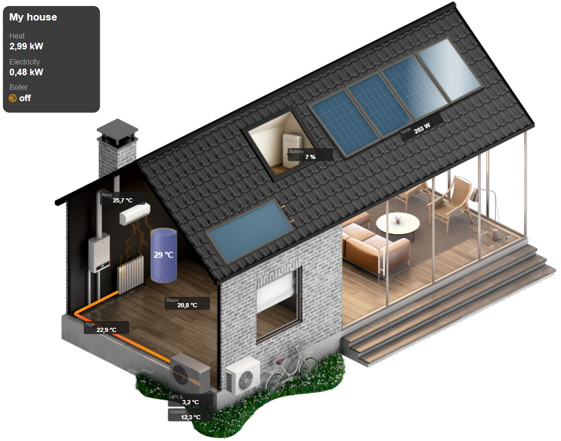

### Features

- **Complete system overview**: Visual representation of your entire Quatt system including heat pump(s), boiler, and heat battery
- **Real-time status**: Live updates of temperatures, power consumption, and operating modes
- **Universal support**: Works with all Quatt configurations:
  - Hybrid setups (heat pump + boiler)
  - All-Electric setups (with heat battery/heat charger)
  - Quatt Mono (single heat pump)
  - Quatt Duo (dual heat pumps)
- **Additional features**:
  - Airconditioning integration including heating and cooling animations
  - Solar panel integration including animations
  - Solar collector integration including animations
  - Home battery integration
  - Hot water tank integration including water temperature animations
- **Responsive design**: Adapts to different screen sizes and devices
- **Custom card implementation**: Uses a dedicated Lovelace custom card for optimal performance

### Prerequisites

The Quatt Dashboard works with the **local CIC JSON API**. Configuring the **Remote Mobile API** is optional but recommended for more accurate heat pump images.

To get the most out of the Quatt Dashboard:

1. **Optional: Remote API configured**: Configure the Remote Mobile API (see [Remote Mobile API](#remote-mobile-api)).
2. **Optional: `OduType` sensor enabled**: The `OduType` (ODU Type) sensor is used to select the correct heat pump image.

   - When `OduType` is **available and enabled**, the dashboard shows the **accurate heat pump image** for your unit.
   - When `OduType` is **not available** (for example if the Remote API is not configured), the dashboard will still work but will fall back to **generic v1 heat pump images**.

   The `OduType` sensor is disabled by default. To enable it:

   - Go to `Settings` → `Devices & services` → `Integrations` → `Quatt`
   - Click on your CIC device
   - Find the `OduType` sensor under the Diagnostics of the Heatpump (if you have two heatpumps enabling one is enough)
   - Click on the sensor and enable it

### Installation

The Quatt Dashboard is implemented as a custom Lovelace card which is installed automatically during installation of the integration, making it easy to add the card to any dashboard.

### Troubleshooting

- **Card not found**:
  - Ensure Home Assistant has loaded the integration properly. Does the config have a `quatt-dashboard-card.js` file in `<HA config>/custom_components/quatt/www/js/`? Download a newer version when the file is missing.
  - Try restarting Home Assistant
  - Caching can be an issue, clear the cache or try incognito mode
- **Generic heat pump image**: Enable and configure the `OduType` sensor (requires Remote API) to show the accurate heat pump image instead of the generic v1 image
- **Mobile card not loading**: On Android/iOS devices newly added cards may not load. Caching can be an issue. On Android/iOS clear the cache and or wipe Home Assistant application data and log back in. On iOS a double pull-down of the screen with the card in it may result in it loading properly.

## Usage graphs with ApexCharts

> ⚠️ **Beta** — example files may change between versions.

Using the on-demand actions ([`quatt.get_cic_insights`](#quattget_cic_insights), [`quatt.get_home_battery_insights`](#quattget_home_battery_insights), [`quatt.get_home_battery_energy_flow`](#quattget_home_battery_energy_flow), [`quatt.get_home_battery_savings`](#quattget_home_battery_savings)) it is possible to recreate Quatt-style **usage graphs** (similar to the official app) in Home Assistant.

<table>
  <tr>
    <td align="center">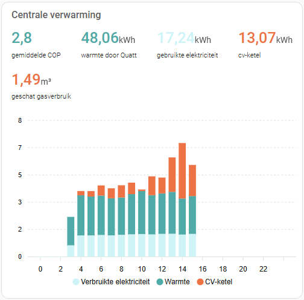<br><b>Day</b></td>
    <td align="center">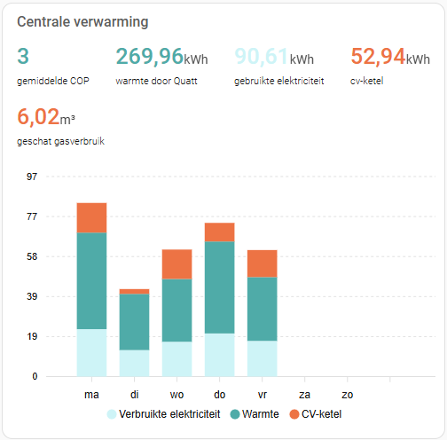<br><b>Week</b></td>
    <td align="center">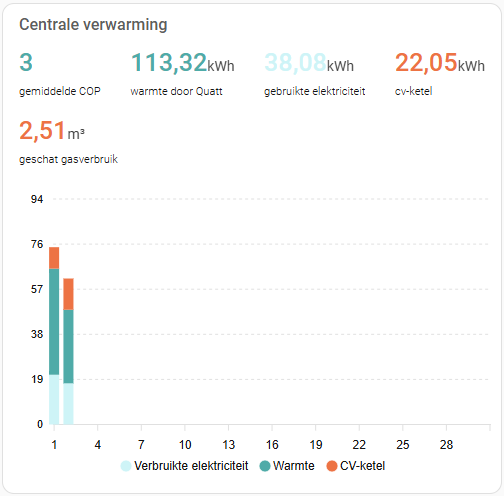<br><b>Month</b></td>
    <td align="center">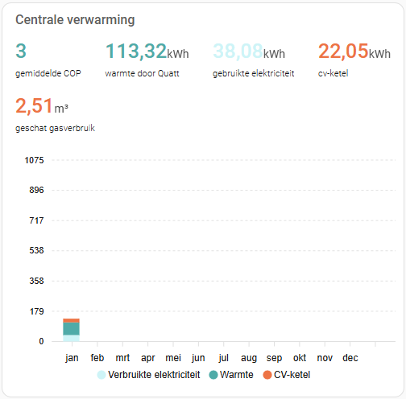<br><b>Year</b></td>
    <td align="center">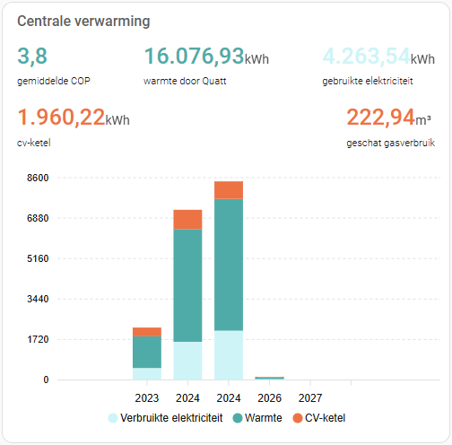<br><b>All</b></td>
  </tr>
</table>

### The pattern

Each usage graph uses the same set of building blocks:

- A `quatt.*` **action (service)** that fetches detailed usage data from Quatt
- A small **Python script** that stores the retrieved JSON data in a Home Assistant sensor
- An **automation** that runs the action + Python script periodically
- An **ApexCharts custom card** that reads the raw sensor and renders a stacked bar chart

> ℹ️ **API refresh rate**
>
> Insights, energy-flow and savings data on the Quatt side are refreshed at most a few times per hour (CIC insights: roughly once per hour; home battery: roughly once per `remote_scan_interval` minutes). Polling more frequently does not return fresher data — please do **not** schedule the automations more often than the recommended values in the example files.

### Prerequisites

1. **ApexCharts card installed** — Install the **ApexCharts Card** via HACS (Frontend → search for `apexcharts-card`).
2. **Python Scripts enabled in Home Assistant** — In your `configuration.yaml`:

   ```yaml
   python_script:
   ```

   Create a `python_scripts` folder in your Home Assistant config directory if it doesn't exist yet.

### Setup

1. Copy the relevant Python script(s) from `examples/set_*.py` into `<HA config>/python_scripts/`.
2. Import the relevant automation(s) from `examples/automation_*.yaml`. Either paste them into Settings → Automations & Scenes → Add automation → Edit in YAML, or include them in `automations.yaml`. To spread load across the Quatt servers, **change the minute value** in each trigger to a value that's unique for your installation (for example, somewhere between 13 and 20 instead of the default `15`).
3. Add a new Manual card in your dashboard and paste the contents of the relevant `examples/apexcharts_*.yaml`.

### Example files

#### CIC insights

- Python script: [`examples/set_cic_insights.py`](examples/set_cic_insights.py)
- Automation (hourly, configurable timeframes): [`examples/automation_cic_insights.yaml`](examples/automation_cic_insights.yaml)
- ApexCharts cards:
  - Day: [`examples/apexcharts_quatt_insights_day.yaml`](examples/apexcharts_quatt_insights_day.yaml)
  - Week: [`examples/apexcharts_quatt_insights_week.yaml`](examples/apexcharts_quatt_insights_week.yaml)
  - Month: [`examples/apexcharts_quatt_insights_month.yaml`](examples/apexcharts_quatt_insights_month.yaml)
  - Year: [`examples/apexcharts_quatt_insights_year.yaml`](examples/apexcharts_quatt_insights_year.yaml)
  - All: [`examples/apexcharts_quatt_insights_all.yaml`](examples/apexcharts_quatt_insights_all.yaml)

The automation populates `sensor.quatt_cic_insights_<day|week|month|year|all>`. Update its `periods_to_fetch` variable to limit which timeframes are queried and reduce the number of API calls.

#### Home battery — insights

- Python script: [`examples/set_home_battery_insights.py`](examples/set_home_battery_insights.py)
- Automation (today + specific date): [`examples/automation_home_battery_insights.yaml`](examples/automation_home_battery_insights.yaml)
- ApexCharts card:
  - Today (charge state): [`examples/apexcharts_home_battery_insights_day.yaml`](examples/apexcharts_home_battery_insights_day.yaml)

#### Home battery — energy flow

- Python script: [`examples/set_home_battery_energy_flow.py`](examples/set_home_battery_energy_flow.py)
- Automation (today / day / month / year): [`examples/automation_home_battery_energy_flow.yaml`](examples/automation_home_battery_energy_flow.yaml)
- ApexCharts cards:
  - Day: [`examples/apexcharts_home_battery_energy_flow_day.yaml`](examples/apexcharts_home_battery_energy_flow_day.yaml)
  - Month: [`examples/apexcharts_home_battery_energy_flow_month.yaml`](examples/apexcharts_home_battery_energy_flow_month.yaml)
  - Year: [`examples/apexcharts_home_battery_energy_flow_year.yaml`](examples/apexcharts_home_battery_energy_flow_year.yaml)

#### Home battery — savings

- Python script: [`examples/set_home_battery_savings.py`](examples/set_home_battery_savings.py)
- Automation (month / year): [`examples/automation_home_battery_savings.yaml`](examples/automation_home_battery_savings.yaml)
- ApexCharts cards:
  - Month: [`examples/apexcharts_home_battery_savings_month.yaml`](examples/apexcharts_home_battery_savings_month.yaml)
  - Year: [`examples/apexcharts_home_battery_savings_year.yaml`](examples/apexcharts_home_battery_savings_year.yaml)

## Actions reference

### `quatt.get_cic_insights`

Retrieves insights data for a specific time period from the Quatt installation. The end date is automatically calculated based on `from_date` and `timeframe`.

| Field | Required | Default | Description |
|---|---|---|---|
| `from_date` | no | `2020-01-01` | Start date in ISO format (`YYYY-MM-DD`) |
| `timeframe` | no | `all` | One of `all`, `day`, `week`, `month`, `year` |
| `advanced_insights` | no | `true` | Include advanced insights data |

CIC insights are refreshed by Quatt **roughly once per hour** — do not poll more frequently.

### `quatt.get_home_battery_insights`

Retrieves home battery insights as a 15-minute timeseries (power, charge state, control action and control mode) from the Quatt mobile API.

| Field | Required | Description |
|---|---|---|
| `year` | no¹ | Year (e.g. `2026`) |
| `month` | no¹ | Month, 1-12 |
| `day` | no¹ | Day of month, 1-31 |

¹ Provide all three for a specific date, or none for today.

### `quatt.get_home_battery_energy_flow`

Retrieves the home battery energy-flow timeseries and aggregated totals (battery charge/discharge, solar, house, grid import/export). The scope is determined by which fields you provide:

| Fields provided | Scope |
|---|---|
| (none) | Today |
| `year` + `month` + `day` | A specific day |
| `year` + `month` | A specific month |
| `year` | A specific year |

### `quatt.get_home_battery_savings`

Retrieves the home battery savings timeseries and aggregated totals (home battery, solar, imbalance and total savings, in cents incl. and excl. VAT).

| Fields provided | Scope (granularity) |
|---|---|
| (none) | Current month (daily granularity) |
| `year` + `month` | A specific month (daily granularity) |
| `year` | A specific year (monthly granularity) |

## Contributions

Contributions are welcome!

Special thanks to [@patrickvorgers](https://github.com/patrickvorgers) for maintaining this integration and enhancing it to its current level.

If you want to contribute to this please read the [Contribution guidelines](CONTRIBUTING.md).

[home-assistant-quatt]: https://github.com/marcoboers/home-assistant-quatt
[buymecoffee]: https://www.buymeacoffee.com/marcoboers
[buymecoffeebadge]: https://www.buymeacoffee.com/assets/img/custom_images/orange_img.png
[commits-shield]: https://img.shields.io/github/commit-activity/y/marcoboers/home-assistant-quatt.svg?style=for-the-badge
[commits]: https://github.com/marcoboers/home-assistant-quatt/commits/main
[hacs]: https://my.home-assistant.io/redirect/hacs_repository/?owner=marcoboers&repository=home-assistant-quatt&category=integration
[hacsbadge]: https://img.shields.io/badge/HACS-Custom-orange.svg?style=for-the-badge
[exampleimg]: example.png
[forum-shield]: https://img.shields.io/badge/community-forum-brightgreen.svg?style=for-the-badge
[forum]: https://community.home-assistant.io/
[license-shield]: https://img.shields.io/github/license/marcoboers/home-assistant-quatt.svg?style=for-the-badge
[maintenance-shield]: https://img.shields.io/badge/maintainer-marcoboers-blue.svg?style=for-the-badge
[releases-shield]: https://img.shields.io/github/release/marcoboers/home-assistant-quatt.svg?style=for-the-badge
[releases]: https://github.com/marcoboers/home-assistant-quatt/releases
