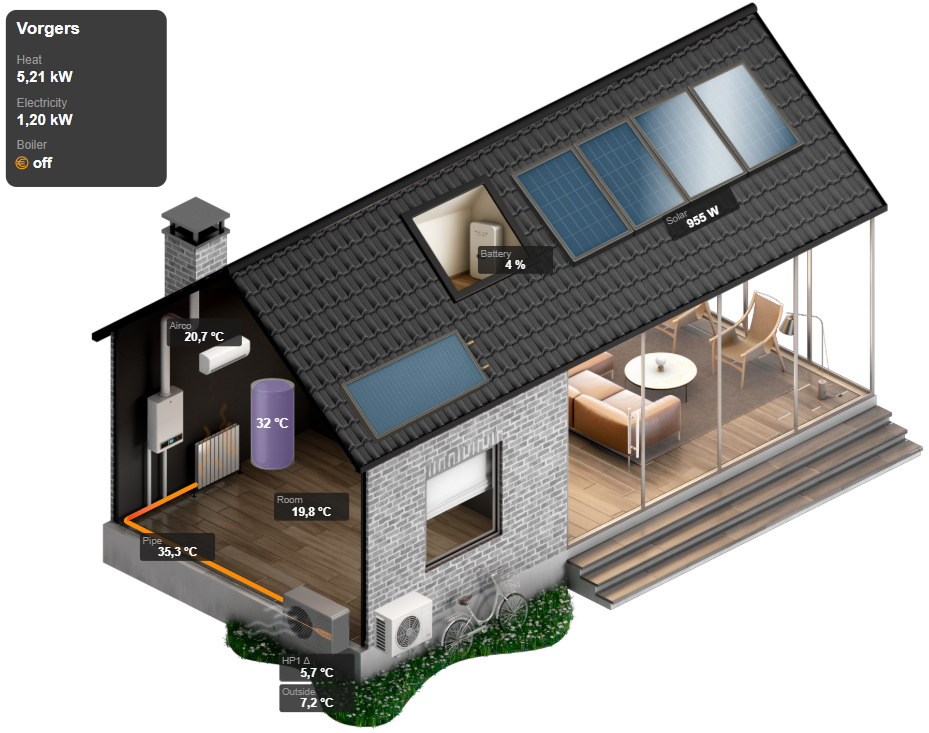

[Quatt integration](../README.md) › [Documentation](README.md) › Dashboard card

# Dashboard card

> [!WARNING]
> **Beta** — no backwards-compatibility guarantees between versions.

This integration includes a fully-featured **Quatt Dashboard Card** that replicates and enhances the dashboard from the official Quatt mobile app directly in Home Assistant. It provides a comprehensive, at-a-glance view of your Quatt heat pump system status and performance.



## Features

- **Complete system overview**: Visual representation of your entire Quatt system including heat pump(s), boiler, and heat battery
- **Real-time status**: Live updates of temperatures, power consumption, and operating modes
- **Universal support**: Works with all Quatt configurations:
  - Hybrid setups (heat pump + boiler)
  - All-Electric setups (with heat battery/heat charger)
  - Quatt Mono (single heat pump)
  - Quatt Duo (dual heat pumps)
- **Additional features**:
  - Airconditioning integration including heating and cooling animations
  - Solar panel integration including animations
  - Solar collector integration including animations
  - Home battery integration
  - Hot water tank integration including water temperature animations
- **Responsive design**: Adapts to different screen sizes and devices
- **Custom card implementation**: Uses a dedicated Lovelace custom card for optimal performance

## Prerequisites

The Quatt Dashboard works with the **local CIC JSON API**. Configuring the **Remote Mobile API** is optional but recommended for more accurate heat pump images.

To get the most out of the Quatt Dashboard:

1. **Optional: Remote API configured**: Configure the Remote Mobile API (see [Remote Mobile API](remote-mobile-api.md)).
2. **Optional: `OduType` sensor enabled**: The `OduType` (ODU Type) sensor is used to select the correct heat pump image.

   - When `OduType` is **available and enabled**, the dashboard shows the **accurate heat pump image** for your unit.
   - When `OduType` is **not available** (for example if the Remote API is not configured), the dashboard will still work but will fall back to **generic v1 heat pump images**.

   The `OduType` sensor is disabled by default. To enable it:

   - Go to `Settings` → `Devices & services` → `Integrations` → `Quatt`
   - Click on your CIC device
   - Find the `OduType` sensor under the Diagnostics of the Heatpump (if you have two heatpumps enabling one is enough)
   - Click on the sensor and enable it

## Installation

The Quatt Dashboard is implemented as a custom Lovelace card which is installed automatically during installation of the integration, making it easy to add the card to any dashboard.

## Adding the card

1. Open a dashboard and click the pencil icon to edit it
2. Click `+ Add card` and search for **Quatt Dashboard Card**
3. Configure the card in the visual editor and click `Save`

In YAML, the card starts from:

```yaml
type: custom:quatt-dashboard-card
system_setup:
  house_label: My house
```

## Troubleshooting

- **Card not found**:
  - Ensure Home Assistant has loaded the integration properly. Does the config have a `quatt-dashboard-card.js` file in `<HA config>/custom_components/quatt/www/js/`? Download a newer version when the file is missing.
  - Try restarting Home Assistant
  - Caching can be an issue, clear the cache or try incognito mode
- **Generic heat pump image**: Enable and configure the `OduType` sensor (requires Remote API) to show the accurate heat pump image instead of the generic v1 image
- **Mobile card not loading**: On Android/iOS devices newly added cards may not load. Caching can be an issue. On Android/iOS clear the cache and or wipe Home Assistant application data and log back in. On iOS a double pull-down of the screen with the card in it may result in it loading properly.
