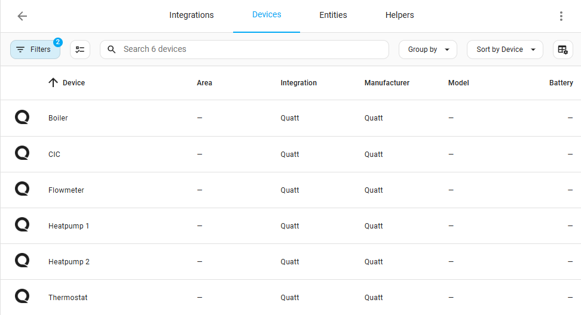

[Quatt integration](../README.md) › [Documentation](README.md) › Heat pump

# Heat pump

The heat pump is read from the Quatt CIC (Commander In Chief) over its **local JSON API**. This works entirely on your local network; no Quatt account is needed. See [Adding a CIC](configuration.md#adding-a-cic-heat-pump) to set it up.

## Devices

The sensors are grouped into separate devices under the CIC: **CIC**, **Heatpump 1** and **Heatpump 2** (Quatt Duo), **Boiler** (Hybrid), **Heat battery** and **Heat charger** (All-Electric), **Flowmeter** and **Thermostat**. Only the devices and sensors that apply to your installation type are created.

## Sensors

All sensors from the local API feed are available. In addition, the following computed sensors are provided:

### CIC

- **Supervisory control mode**: Textual representation of the QC `supervisoryControlMode` status.
- **COP**: Calculated using the produced heat and the power consumed by the external power sensor (configurable, see [Options](configuration.md#cic-heat-pump)).
- **Heat power**: Heat output of the heat pumps.
- **Total power**: Combined heat output of both heatpumps (Quatt Duo only).
- **Total power input**: Combined power input of both heatpumps (Quatt Duo only).
- **Total system power**: Combined system power
  - All-electric setup: `heat charger + heatpump(s)`
  - Standard setup: `boiler + heatpump(s)`
- **Total Quatt COP**: COP calculated using the produced heat and the power used by the heatpump(s).

### Heatpump

- **Quatt COP**: COP calculated using the produced heat and the power used by the heatpump.
- **Water delta**: Difference between inlet and outlet water temperatures.

### Boiler

- **Heat power**: Heat output of the boiler.

## More data

- Additional sensors and controls — including the heat pump's observed compressor starts — are available when the [Remote Mobile API](remote-mobile-api.md) is enabled.
- The [Dashboard card](dashboard-card.md) shows the heat pump at a glance.
- Historical insights (as in the Quatt app) can be fetched with [`quatt.get_cic_insights`](actions.md#quattget_cic_insights) and graphed with [ApexCharts](usage-graphs.md#cic-insights).
