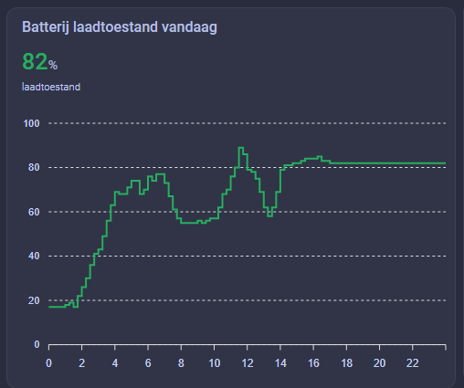
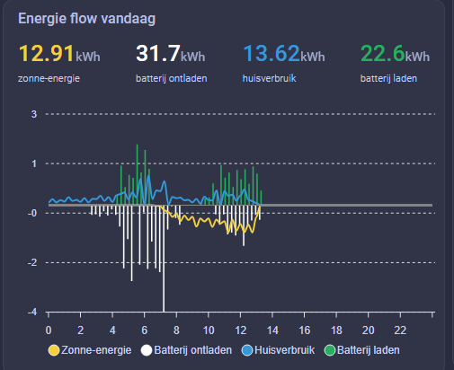
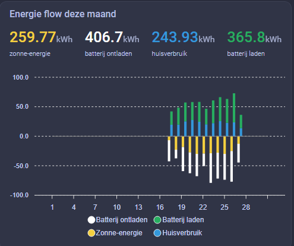
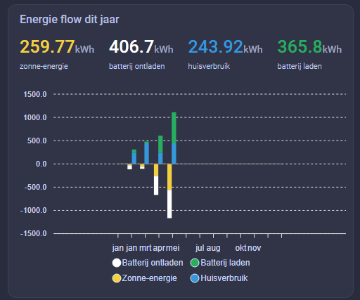
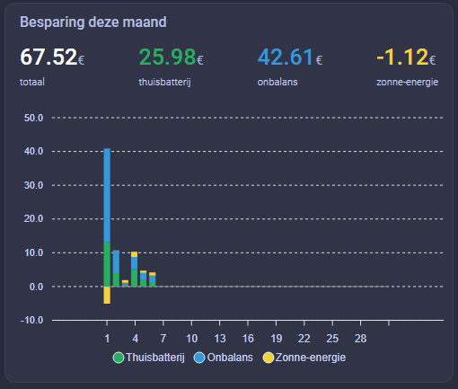
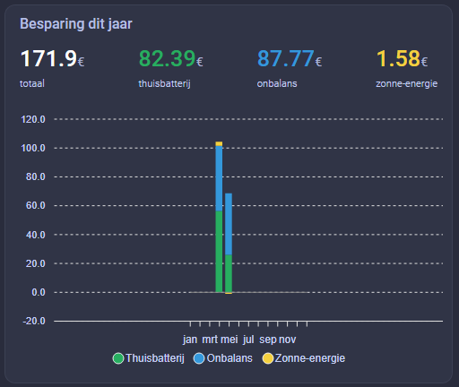

[Quatt integration](../README.md) › [Documentation](README.md) › Home battery

# Home battery

> [!NOTE]
> Built on the reverse-engineered Quatt mobile API — see [About reverse-engineered features](../README.md#about-reverse-engineered-features).

The home battery is a separate device that can be added alongside (or independently of) a Quatt heat pump. Once paired it exposes live status, savings, insights and full energy-flow data (battery, solar, house, grid) in Home Assistant.

<table>
  <tr>
    <td align="center"> <b>Insights (today)</b></td>
    <td align="center"> <b>Energy flow (day)</b></td>
    <td align="center"> <b>Energy flow (month)</b></td>
  </tr>
  <tr>
    <td align="center"> <b>Energy flow (year)</b></td>
    <td align="center"> <b>Savings (month)</b></td>
    <td align="center"> <b>Savings (year)</b></td>
  </tr>
</table>

## Features

- **Stand-alone device**: A home battery can be added without a CIC/heat pump — pick "Home battery" in the `+ Add integration` menu
- **Live status**: State of charge, power, power flow direction, control action, control mode, capacity and inverter power
- **Cumulative and yesterday savings**: Total, home battery, solar and imbalance savings in euros (incl. and excl. VAT)
- **Today's insights**: Charged/discharged kWh, peak charge/discharge power, highest/lowest SoC (based on the 15-minute timeseries)
- **Today's energy flow**: Battery charged/discharged, solar production, house consumption, grid import/export in kWh
- **Solar capacity control**: A `Solar capacity` number entity that PATCHes `solarCapacitykWp` on the installation (used by Quatt for energy-flow calculations)
- **On-demand history**: The actions [`quatt.get_home_battery_insights`](actions.md#quattget_home_battery_insights), [`quatt.get_home_battery_energy_flow`](actions.md#quattget_home_battery_energy_flow) and [`quatt.get_home_battery_savings`](actions.md#quattget_home_battery_savings) fetch specific days, months or years — useful for ApexCharts-style graphs (see [Usage graphs with ApexCharts](usage-graphs.md#home-battery--insights))

## Pairing

See [Configuration › Adding a home battery](configuration.md#adding-a-home-battery) for the pairing flow.

## Caching

Today's insights and energy-flow data are cached client-side to match the Quatt server-side refresh rate (roughly once per `remote_scan_interval` minutes, the **Remote mobile API update interval** in the [Options](configuration.md#home-battery)). Calling the actions more frequently does not return fresher data.
