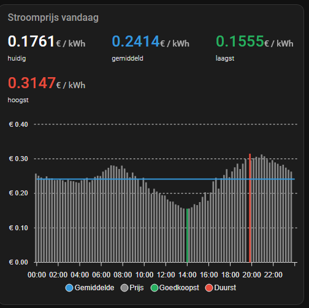
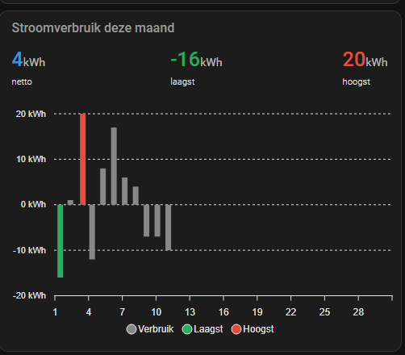
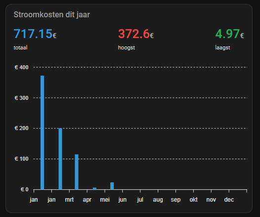

[Quatt integration](../README.md) › [Documentation](README.md) › Quatt Energy

# Quatt Energy

> [!NOTE]
> Built on the reverse-engineered Quatt Energy portal — see [About reverse-engineered features](../README.md#about-reverse-engineered-features).

The Quatt Energy hub connects to the separate **Quatt Energy portal** (https://mijnenergie.quatt.io) and exposes live tariff prices plus on-demand history for prices, electricity/gas usage and costs. It is a stand-alone hub — a CIC or home battery is **not** required.

<table>
  <tr>
    <td align="center"> <b>Prices (day)</b></td>
    <td align="center"> <b>Usage (month)</b></td>
    <td align="center"> <b>Costs (year)</b></td>
  </tr>
</table>

## Features

- **Stand-alone device**: Add an Energy hub without a CIC or home battery by selecting "Energy (mijnenergie)" in the `+ Add integration` menu.
- **Live price sensors** (refreshed on the hub's poll interval):
  - **Current energy price** — price for the current quarter-hour window, with `period_start`, `period_end`, `period_label`, `time_window`, `product` and `date` attributes
  - **Cheapest energy price today** — minimum quarter-hour price today, with the slot's `time`, `time_end`, `time_label` and `time_window`
  - **Most expensive energy price today** — analogous to cheapest
  - **Average energy price today**
- **EAN diagnostic** sensor showing the meter identifier registered in the portal
- **Surcharge toggles** — three switches that map directly to the `vat`, `tax` and `markup` query parameters on the portal's prices endpoint:
  - **Include VAT**
  - **Include energy tax**
  - **Include supplier markup**

  Flipping a switch immediately changes the prices returned by the live sensors and by the [`quatt.get_energy_prices`](actions.md#quattget_energy_prices) action on the next call. The flags are persisted per hub so they survive restarts.
- **On-demand history**: The actions [`quatt.get_energy_prices`](actions.md#quattget_energy_prices), [`quatt.get_energy_power`](actions.md#quattget_energy_power) and [`quatt.get_energy_costs`](actions.md#quattget_energy_costs) fetch detail for a chosen day, month or year — useful for ApexCharts-style graphs (see [Usage graphs with ApexCharts](usage-graphs.md#energy--prices)).

## Pairing

See [Configuration › Adding a Quatt Energy hub](configuration.md#adding-a-quatt-energy-hub) for the sign-in flow. The poll interval and the stored password can be changed in the [Options](configuration.md#energy-mijnenergie).

## Refresh-rate caveats

- **Prices** are published by the portal roughly **once per day**.
- **Power (usage)** and **costs** lag the portal by roughly **two days** — today's measurements are not yet exposed. The example automations therefore fetch `(now − 2 days)` for the day scope.
- Polling more frequently than the example values does not return fresher data.
