[Quatt integration](../README.md) › [Documentation](README.md) › Usage graphs with ApexCharts

# Usage graphs with ApexCharts

> [!WARNING]
> **Beta** — example files may change between versions.

Using the on-demand [actions](actions.md) it is possible to recreate Quatt-style **usage graphs** (similar to the official app) in Home Assistant.

<table>
  <tr>
    <td align="center">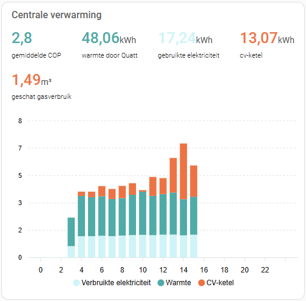<br><b>Day</b></td>
    <td align="center">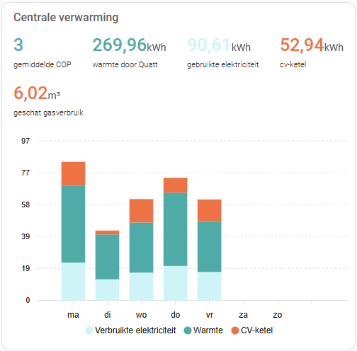<br><b>Week</b></td>
    <td align="center">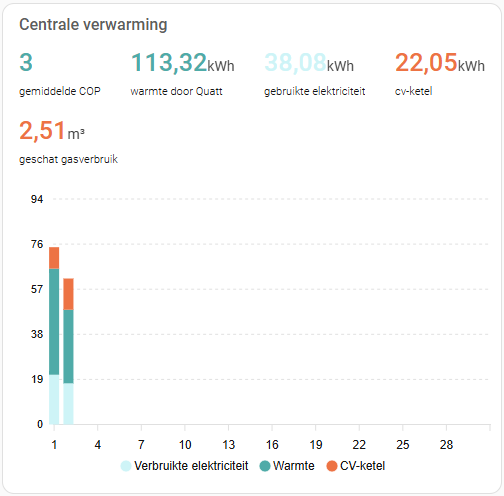<br><b>Month</b></td>
    <td align="center">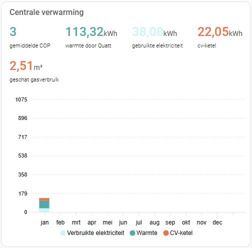<br><b>Year</b></td>
    <td align="center">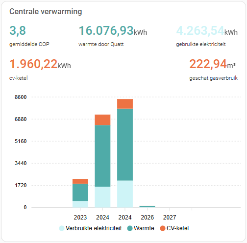<br><b>All</b></td>
  </tr>
</table>

## The pattern

Each usage graph uses the same set of building blocks:

- A `quatt.*` **action (service)** that fetches detailed usage data from Quatt
- A small **Python script** that stores the retrieved JSON data in a Home Assistant sensor
- An **automation** that runs the action + Python script periodically
- An **ApexCharts custom card** that reads the raw sensor and renders a stacked bar chart

> [!IMPORTANT]
> **API refresh rate** — Insights, energy-flow and savings data on the Quatt side are refreshed at most a few times per hour (CIC insights: roughly once per hour; home battery: roughly once per `remote_scan_interval` minutes). Energy prices are published roughly once per day, and energy usage and costs lag by roughly two days. Polling more frequently does not return fresher data — please do **not** schedule the automations more often than the recommended values in the example files.

## Prerequisites

1. **ApexCharts card installed** — Install the **ApexCharts Card** via HACS (Frontend → search for `apexcharts-card`).
2. **Python Scripts enabled in Home Assistant** — In your `configuration.yaml`:

   ```yaml
   python_script:
   ```

   Create a `python_scripts` folder in your Home Assistant config directory if it doesn't exist yet.

## Setup

1. Copy the relevant Python script(s) from `examples/set_*.py` into `<HA config>/python_scripts/`.
2. Import the relevant automation(s) from `examples/automation_*.yaml`. Either paste them into Settings → Automations & Scenes → Add automation → Edit in YAML, or include them in `automations.yaml`. To spread load across the Quatt servers, **change the minute value** in each trigger to a value that's unique for your installation (for example, somewhere between 13 and 20 instead of the default `15`).
3. Add a new Manual card in your dashboard and paste the contents of the relevant `examples/apexcharts_*.yaml`.

All example files are listed in [`examples/`](../examples/README.md).

## Example files

| Graph | Action | Requires |
|---|---|---|
| [CIC insights](#cic-insights) | [`quatt.get_cic_insights`](actions.md#quattget_cic_insights) | [Remote Mobile API](remote-mobile-api.md) |
| [Home battery — insights](#home-battery--insights) | [`quatt.get_home_battery_insights`](actions.md#quattget_home_battery_insights) | [Home battery](home-battery.md) |
| [Home battery — energy flow](#home-battery--energy-flow) | [`quatt.get_home_battery_energy_flow`](actions.md#quattget_home_battery_energy_flow) | [Home battery](home-battery.md) |
| [Home battery — savings](#home-battery--savings) | [`quatt.get_home_battery_savings`](actions.md#quattget_home_battery_savings) | [Home battery](home-battery.md) |
| [Energy — prices](#energy--prices) | [`quatt.get_energy_prices`](actions.md#quattget_energy_prices) | [Quatt Energy](quatt-energy.md) |
| [Energy — power (usage)](#energy--power-usage) | [`quatt.get_energy_power`](actions.md#quattget_energy_power) | [Quatt Energy](quatt-energy.md) |
| [Energy — costs](#energy--costs) | [`quatt.get_energy_costs`](actions.md#quattget_energy_costs) | [Quatt Energy](quatt-energy.md) |

### CIC insights

- Python script: [`examples/set_cic_insights.py`](../examples/set_cic_insights.py)
- Automation (hourly, configurable timeframes): [`examples/automation_cic_insights.yaml`](../examples/automation_cic_insights.yaml)
- ApexCharts cards:
  - Day: [`examples/apexcharts_quatt_insights_day.yaml`](../examples/apexcharts_quatt_insights_day.yaml)
  - Week: [`examples/apexcharts_quatt_insights_week.yaml`](../examples/apexcharts_quatt_insights_week.yaml)
  - Month: [`examples/apexcharts_quatt_insights_month.yaml`](../examples/apexcharts_quatt_insights_month.yaml)
  - Year: [`examples/apexcharts_quatt_insights_year.yaml`](../examples/apexcharts_quatt_insights_year.yaml)
  - All: [`examples/apexcharts_quatt_insights_all.yaml`](../examples/apexcharts_quatt_insights_all.yaml)

The automation populates `sensor.quatt_cic_insights_<day|week|month|year|all>`. Update its `periods_to_fetch` variable to limit which timeframes are queried and reduce the number of API calls.

### Home battery — insights

<table>
  <tr>
    <td align="center"><br><b>Today (charge state)</b></td>
  </tr>
</table>

- Python script: [`examples/set_home_battery_insights.py`](../examples/set_home_battery_insights.py)
- Automation (today + specific date): [`examples/automation_home_battery_insights.yaml`](../examples/automation_home_battery_insights.yaml)
- ApexCharts card:
  - Today (charge state): [`examples/apexcharts_home_battery_insights_day.yaml`](../examples/apexcharts_home_battery_insights_day.yaml)

### Home battery — energy flow

<table>
  <tr>
    <td align="center"><br><b>Day</b></td>
    <td align="center"><br><b>Month</b></td>
    <td align="center"><br><b>Year</b></td>
  </tr>
</table>

- Python script: [`examples/set_home_battery_energy_flow.py`](../examples/set_home_battery_energy_flow.py)
- Automation (today / day / month / year): [`examples/automation_home_battery_energy_flow.yaml`](../examples/automation_home_battery_energy_flow.yaml)
- ApexCharts cards:
  - Day: [`examples/apexcharts_home_battery_energy_flow_day.yaml`](../examples/apexcharts_home_battery_energy_flow_day.yaml)
  - Month: [`examples/apexcharts_home_battery_energy_flow_month.yaml`](../examples/apexcharts_home_battery_energy_flow_month.yaml)
  - Year: [`examples/apexcharts_home_battery_energy_flow_year.yaml`](../examples/apexcharts_home_battery_energy_flow_year.yaml)

### Home battery — savings

<table>
  <tr>
    <td align="center"><br><b>Month</b></td>
    <td align="center"><br><b>Year</b></td>
  </tr>
</table>

- Python script: [`examples/set_home_battery_savings.py`](../examples/set_home_battery_savings.py)
- Automation (month / year): [`examples/automation_home_battery_savings.yaml`](../examples/automation_home_battery_savings.yaml)
- ApexCharts cards:
  - Month: [`examples/apexcharts_home_battery_savings_month.yaml`](../examples/apexcharts_home_battery_savings_month.yaml)
  - Year: [`examples/apexcharts_home_battery_savings_year.yaml`](../examples/apexcharts_home_battery_savings_year.yaml)

### Energy — prices

Requires the [Quatt Energy](quatt-energy.md) hub. Whether VAT, energy tax and supplier markup are included is controlled by the **Include VAT / energy tax / supplier markup** switches on the hub.

<table>
  <tr>
    <td align="center"><br><b>Day</b></td>
    <td align="center">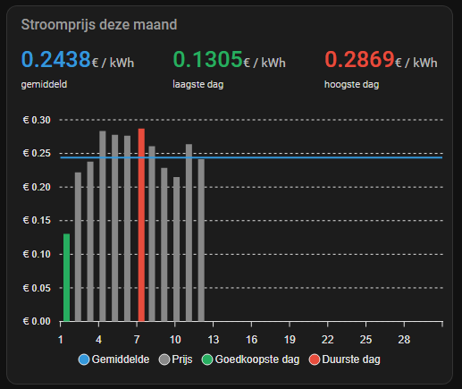<br><b>Month</b></td>
    <td align="center">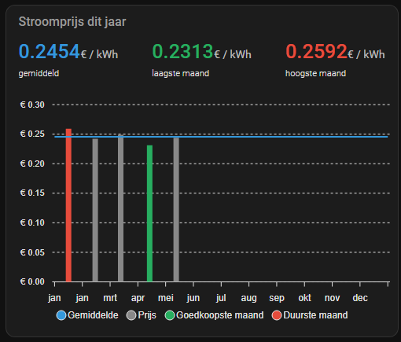<br><b>Year</b></td>
  </tr>
</table>

- Python script: [`examples/set_energy_prices.py`](../examples/set_energy_prices.py)
- Automation (day / month / year): [`examples/automation_energy_prices.yaml`](../examples/automation_energy_prices.yaml)
- ApexCharts cards:
  - Day: [`examples/apexcharts_quatt_energy_prices_day.yaml`](../examples/apexcharts_quatt_energy_prices_day.yaml)
  - Month: [`examples/apexcharts_quatt_energy_prices_month.yaml`](../examples/apexcharts_quatt_energy_prices_month.yaml)
  - Year: [`examples/apexcharts_quatt_energy_prices_year.yaml`](../examples/apexcharts_quatt_energy_prices_year.yaml)

The automation populates `sensor.quatt_energy_prices_<day|month|year>`.

### Energy — power (usage)

Requires the [Quatt Energy](quatt-energy.md) hub.

<table>
  <tr>
    <td align="center">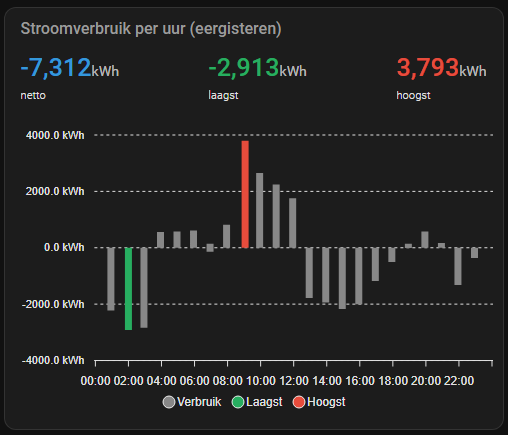<br><b>Day (lagged 2 days)</b></td>
    <td align="center"><br><b>Month</b></td>
    <td align="center">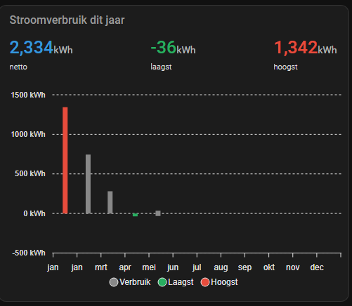<br><b>Year</b></td>
  </tr>
</table>

- Python script: [`examples/set_energy_power.py`](../examples/set_energy_power.py)
- Automation (day lagged by 2 days / year): [`examples/automation_energy_power.yaml`](../examples/automation_energy_power.yaml)
- ApexCharts cards:
  - Day: [`examples/apexcharts_quatt_energy_power_day.yaml`](../examples/apexcharts_quatt_energy_power_day.yaml)
  - Month: [`examples/apexcharts_quatt_energy_power_month.yaml`](../examples/apexcharts_quatt_energy_power_month.yaml)
  - Year: [`examples/apexcharts_quatt_energy_power_year.yaml`](../examples/apexcharts_quatt_energy_power_year.yaml)

The automation populates `sensor.quatt_energy_power_<day|year>`; the month card is rendered from the `year` aggregate, so the year automation drives both the month and year ApexCharts cards.

> [!NOTE]
> The portal does not publish today's usage yet, so the day card uses an `offset: "-2d"` and the automation fetches data for **two days ago**.

### Energy — costs

Requires the [Quatt Energy](quatt-energy.md) hub.

<table>
  <tr>
    <td align="center">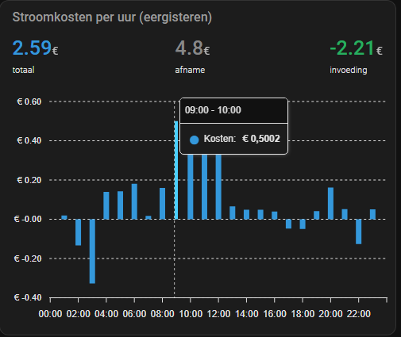<br><b>Day (lagged 2 days)</b></td>
    <td align="center">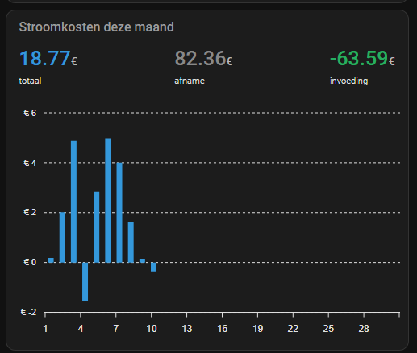<br><b>Month</b></td>
    <td align="center"><br><b>Year</b></td>
  </tr>
</table>

- Python script: [`examples/set_energy_costs.py`](../examples/set_energy_costs.py)
- Automation (day lagged by 2 days / year): [`examples/automation_energy_costs.yaml`](../examples/automation_energy_costs.yaml)
- ApexCharts cards:
  - Day: [`examples/apexcharts_quatt_energy_costs_day.yaml`](../examples/apexcharts_quatt_energy_costs_day.yaml)
  - Month: [`examples/apexcharts_quatt_energy_costs_month.yaml`](../examples/apexcharts_quatt_energy_costs_month.yaml)
  - Year: [`examples/apexcharts_quatt_energy_costs_year.yaml`](../examples/apexcharts_quatt_energy_costs_year.yaml)

The automation populates `sensor.quatt_energy_costs_<day|year>`; the month card is rendered from the `year` aggregate, so the year automation drives both the month and year ApexCharts cards.
